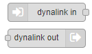
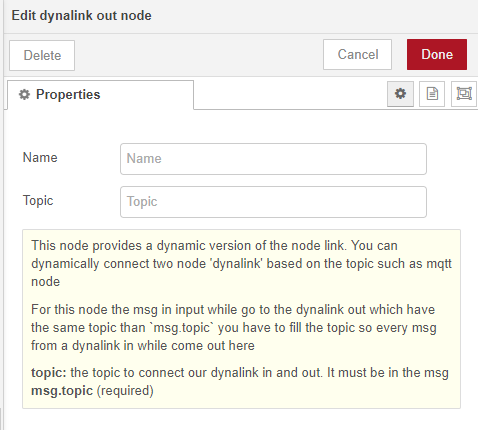
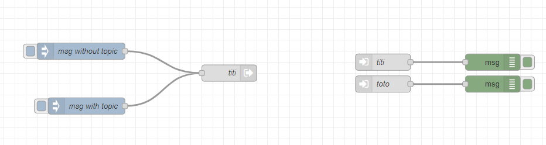

# node-red-contrib-dynalink 



## Description 

This node is similar to the classic node link. With this version you can dynamically connect differrent nodes.
To use this node it is quiet similar to the node mqtt input and output: 
You choose the two nodes dynalink which have the same topic will be connected : 



You can use a same *dynalink input* for several connection. You just have to fill in **msg.topic** with the good topic and the connection change automatically.

If you but a topic in the node configuration and you msg have a topic, the **msg.topic** will have priority on the **node topic**.


## Exemple


```JSON
[{"id":"1d9b4f4d.214a21","type":"dynalink out","z":"ffe6327f.c5b05","name":"titi","topic":"titi","x":490,"y":240,"wires":[]},{"id":"b2b87fcc.dff04","type":"dynalink in","z":"ffe6327f.c5b05","name":"titi","topic":"titi","x":770,"y":220,"wires":[["30e1ed6e.af34d2"]]},{"id":"db9dc371.4788a","type":"dynalink in","z":"ffe6327f.c5b05","name":"toto","topic":"toto","x":770,"y":260,"wires":[["3a277004.3f9ea"]]},{"id":"4c017589.e76abc","type":"inject","z":"ffe6327f.c5b05","name":"msg without topic","props":[{"p":"payload"}],"repeat":"","crontab":"","once":false,"onceDelay":0.1,"topic":"","payload":"Hello World","payloadType":"str","x":220,"y":200,"wires":[["1d9b4f4d.214a21"]]},{"id":"8f08f319.723df","type":"inject","z":"ffe6327f.c5b05","name":"msg with topic","props":[{"p":"payload"},{"p":"topic","vt":"str"}],"repeat":"","crontab":"","once":false,"onceDelay":0.1,"topic":"toto","payload":"Hello World","payloadType":"str","x":230,"y":300,"wires":[["1d9b4f4d.214a21"]]},{"id":"30e1ed6e.af34d2","type":"debug","z":"ffe6327f.c5b05","name":"","active":true,"tosidebar":true,"console":false,"tostatus":false,"complete":"true","targetType":"full","statusVal":"","statusType":"auto","x":970,"y":220,"wires":[]},{"id":"3a277004.3f9ea","type":"debug","z":"ffe6327f.c5b05","name":"","active":true,"tosidebar":true,"console":false,"tostatus":false,"complete":"true","targetType":"full","statusVal":"","statusType":"auto","x":970,"y":260,"wires":[]}]
```
